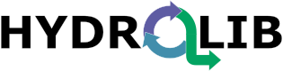

# HYDROLIB

HYDROLIB is a Python package that is being developed collaboratively, with tools for preprocessing, postprocessing and analysis of hydrodynamical data and simulation results dedicated towards the automation of workflows for hydrological and hydrodynamic modelling. Currently it is focused on (but not restricted to) Delft3D FM (D-HYDRO Suite in Dutch) software for hydrodynamical simulations.
HYDROLIB builds upon the basic Delft3D FM I/O functionality provided by the [HYDROLIB-core](https://github.com/Deltares/HYDROLIB-core) package. HYDROLIB-core is distributed under the MIT License. HYDROLIB is distributed under the LGPL 3.0 license.  

## Tools in HYDROLIB
HYDROLIB consist of the following tools:

|            |   |                |
|-----------------------|---|------------------------------|
| D-HyDAMO               |   | modelgenerator from HyDAMO format |
| Profile Optimizer     |   | optimizer of 1D profiles                             |
| Inundation toolbox    |   | toolbox for inundation characteristics                             |
| Case Management tool  |   | tool to manage cases                             |
| ARCADIS tool          |   | pre- and postprocessing tools                             |
| HydroMT-Delft3D FM    |   | data-adaptor and modelbuilder from global and local data                             |

## More information
Feel free to contact us at <a href="mailto:hydrolib@deltares.nl">hydrolib@deltares.nl</a> if you want to know more. 
